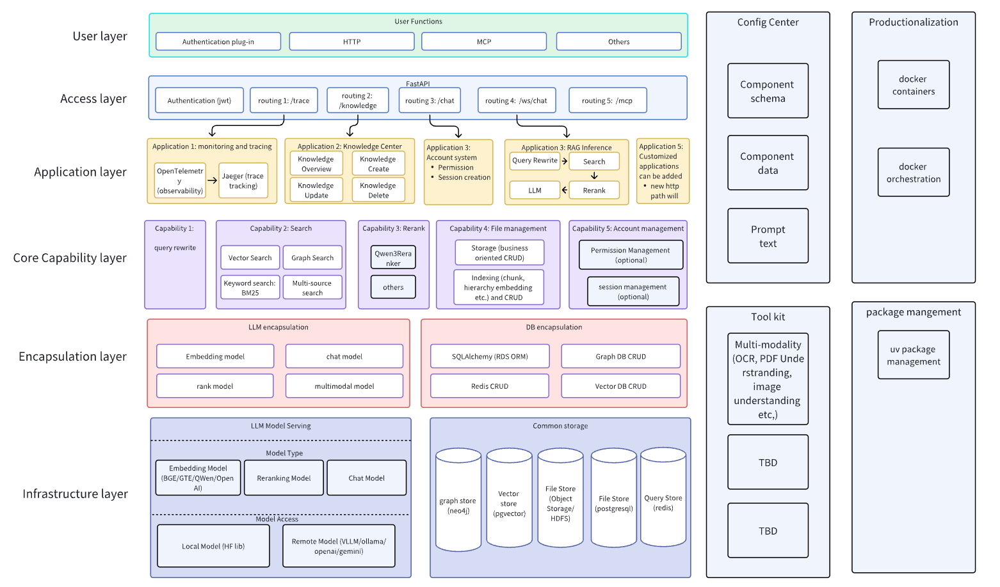
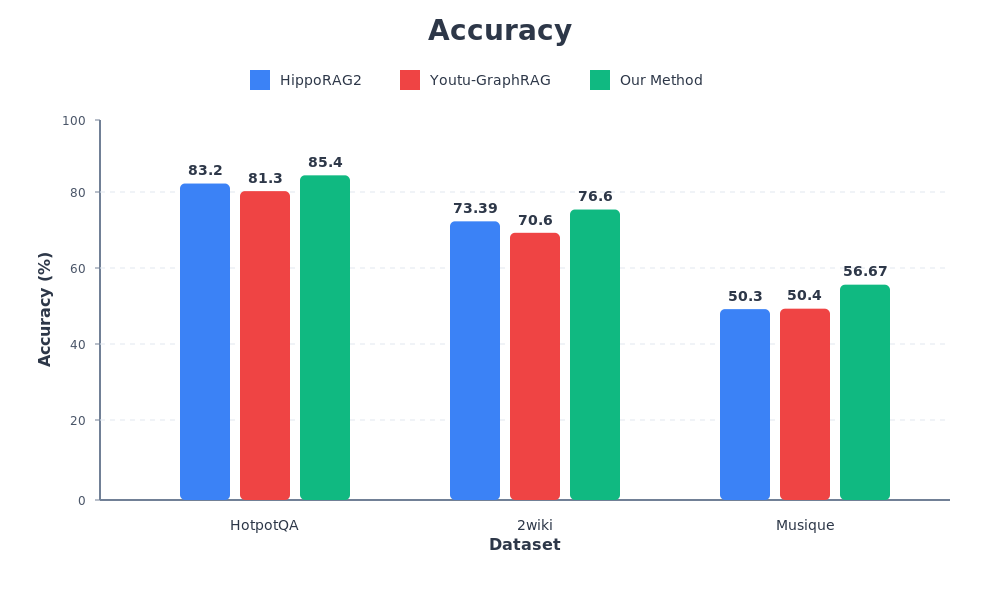
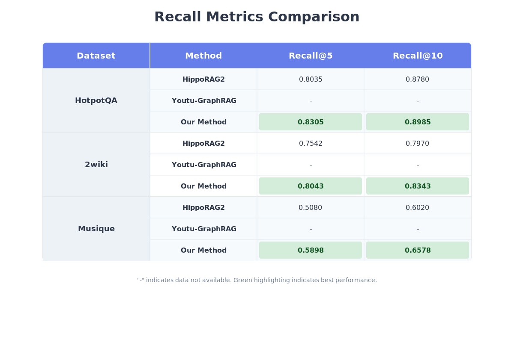
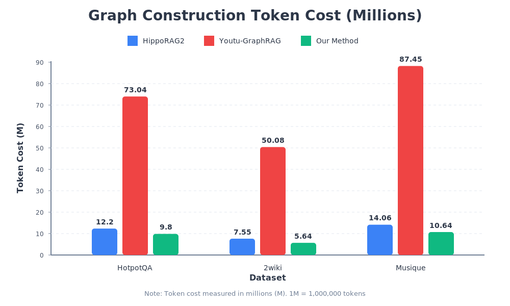

# 🧠 RAG-ARC: Retrieval-Augmented Generation Architecture

[](LICENSE)
[](https://www.python.org/downloads/)
[](https://fastapi.tiangolo.com/)
[](https://github.com/facebookresearch/faiss)
[](https://docs.pydantic.dev/)

*A modular, high-performance Retrieval-Augmented Generation framework with multi-path retrieval, graph extraction, and fusion ranking*

[📘 中文文档](README-CN.md) • [⭐ Key Features](#key-features) • [🏗️ Architecture](#architecture) • [🚀 Quick Start](#quick-start)

## 🎯 Project Overview

**RAG-ARC** is a modular Retrieval-Augmented Generation (RAG) framework designed to build efficient, scalable architectures that support multi-path retrieval, graph structure extraction, and fusion ranking. The system addresses key challenges in traditional RAG systems when processing unstructured documents (PDF, PPT, Excel, etc.) such as information loss, low retrieval accuracy, and difficulty in recognizing multimodal content.

### 🎯 Core Use Cases

🧩 **Full RAG Pipeline Support**: Covers the complete pipeline—from document parsing, text chunking, and embedding generation to multi-path retrieval, graph extraction, reranking, and knowledge graph management.<br>
📚 **Knowledge-Intensive Tasks**: Ideal for question answering, reasoning, and content generation tasks that rely on large-scale structured and unstructured knowledge, ensuring high recall and semantic consistency.<br>
🌐 **Cross-Domain Applications**: Supports both Standard RAG and GraphRAG modes, making it adaptable for academic research, personal knowledge bases, and enterprise-level knowledge management systems.<br>

## 🏗️ Architecture

<div align="center">
<br>
RAG-ARC System Architecture Overview
</div>

## 🔧 Key Features

RAG-ARC introduces several key innovations that together build a sophisticated integrated framework:

### 📁 Multi-Format Document Parsing
- Support for docx, pdf, ppt, excel, html and other file types
- Flexible parsing strategies with OCR and layout-aware PDF parsing (via dots_ocr module)
- Native and VLM-based OCR capabilities

### ✂️ Text Chunking & Vectorization
- Multiple chunking strategies (token-based, semantic, recursive, markdown headers)
- Integration with HuggingFace embedding models for vector representation
- Configurable chunk size and overlap parameters

### 🔍 Multi-Path Retrieval
- Combined BM25 (sparse retrieval), Dense retrieval (Faiss-GPU), and Tantivy full-text search
- Reciprocal Rank Fusion (RRF) for result merging
- Configurable weights and fusion methods

### 🌐 Graph Structure Extraction
- Extracts entities and relations from facts to build structured knowledge graphs
- Seamlessly integrates with Neo4j graph database
- Enables knowledge-graph-driven reasoning and QA

### 🧠 GraphRAG
- Lightweight, incrementally updatable graph construction suitable for enterprise deployment
- Incorporates Subgraph PPR (Personalized PageRank): Compared to HippoRAG2's full-graph PPR, subgraph PPR achieves higher reasoning precision and efficiency

### 📈 Re-ranking (Rerank)
- Qwen3 model for precise result re-ranking
- LLM-based and listwise re-ranking strategies
- Score normalization and metadata enrichment

### 🧩 Modular Design
- Factory pattern for LLM, Embedding, Retriever component creation
- Layered architecture: config, core, encapsulation, application, api
- Singleton pattern for tokenizer management and database connections
- Shared mechanism for retriever and embedding model instance reuse to improve system performance

## 📊 Performance

Built upon the HippoRAG2 evolution, RAG-ARC delivers significant improvements in both efficiency and recall performance:

- 🚀 **22.9% Token Cost Reduction**
Through optimized prompt strategies, it reduces token consumption without sacrificing accuracy.
- 🎯 **5.3% Recall Rate Increase**
Pruning-based optimizations yield more comprehensive and relevant retrieval.
- 🔁 **Incremental Knowledge Graph Updates**
Supports updating graph data without full reconstruction—reducing computational and maintenance overhead.

<div align="center">
  <h3>📊 Performance Comparison</h3>
  <br>
  <br>
  
</div>


## 📁 Project Structure

```
RAG-ARC/
├── 📁 api/                       # API layer (FastAPI routes/MCP integration)
│   ├── routers/                  # API route definitions
│   ├── config_examples/          # Configuration examples
│   └── mcp/                      # MCP server implementation
│
├── 📁 application/               # Business logic layer
│   ├── rag_inference/            # RAG inference module
│   ├── knowledge/                # Knowledge management
│   └── account/                  # User account management
│
├── 📁 core/                      # Core capabilities
│   ├── file_management/          # File parsing and chunking
│   ├── retrieval/                # Retrieval strategies
│   ├── rerank/                   # Re-ranking algorithms
│   ├── query_rewrite/            # Query rewriting
│   └── prompts/                  # Prompt templates
│
├── 📁 config/                    # Configuration system
│   ├── application/              # Application configs
│   ├── core/                     # Core module configs
│   └── encapsulation/            # Encapsulation configs
│
├── 📁 encapsulation/             # Encapsulation layer
│   ├── database/                 # Database interfaces
│   ├── llm/                      # LLM interfaces
│   └── data_model/               # Data models and schemas
│
├── 📁 framework/                 # Framework core
│   ├── module.py                 # Base module class
│   ├── register.py               # Component registry
│   └── config.py                 # Configuration system
│
├── 📁 test/                      # Test suite
│
├── main.py                      # 🎯 Main application entry point
├── app_registration.py          # Component initialization
├── pyproject.toml               # Project dependencies
└── README.md                    # Project documentation
```

## 🚀 Quick Start

### 🐳 Docker Deployment (Recommended)

**Three-step deployment:**

```bash
# 1. Clone the repository
git clone https://github.com/DataArcTech/RAG-ARC.git
cd RAG-ARC

# 2. Build Docker images (one-time setup)
./build.sh

# 3. Start all services
./start.sh
```

The deployment includes:
- ✅ **PostgreSQL 16**: Metadata storage
- ✅ **Redis 7**: Caching layer
- ✅ **Neo4j**: Knowledge graph database
- ✅ **RAG-ARC App**: FastAPI application with GPU support

**What the scripts do:**

`build.sh`:
- Checks Docker environment
- Creates .env configuration
- Selects CPU/GPU mode (auto-detect NVIDIA GPU)
- Pulls base images (PostgreSQL, Redis, Neo4j)
- Builds RAG-ARC application image

`start.sh`:
- Creates Docker network
- Starts all 4 containers
- Waits for services to be ready
- Verifies deployment

`stop.sh`:
- Stops all running containers (keeps data)

`cleanup.sh`:
- Removes all containers and Docker volumes
- Removes Docker network
- **Keeps local data directories** (`./data`, `./local`, `./models`)
- Use when you want to clean Docker resources but keep your data

`clean-docker-data.sh`:
- Removes all containers and Docker volumes
- **Also removes local data directories** (`./data/postgresql`, `./data/neo4j`, `./data/redis`, `./data/graph_index_neo4j`)
- Use when you want a complete cleanup (⚠️ **This will delete all data!**)

**Access the service:**
- API: http://localhost:8000
- API Docs: http://localhost:8000/docs

📖 **See [Docker Deployment Guide (English)](README.Docker.md) or [Docker部署指南（中文）](README.Docker-CN.md) for detailed instructions and troubleshooting**

### 💻 Local Installation

```bash
# 1. Clone the repository
git clone https://github.com/DataArcTech/RAG-ARC.git
cd RAG-ARC

# 2. Install uv if not already installed
# Recommended: Using China mirror (faster in China)
curl -LsSf https://astral.ac.cn/uv/install.sh | sh
# Alternative: Using official installer
# curl -LsSf https://astral.sh/uv/install.sh | sh
# Or add to PATH: export PATH="$HOME/.local/bin:$PATH"

# 3. Install dependencies (uv will automatically create a virtual environment)
# Tsinghua mirror is configured in pyproject.toml
uv sync

# 4. Copy and configure environment variables
cp .env.example .env
# Edit .env to configure your settings
```

### ⚙️ Configuration

RAG-ARC uses a modular configuration system. Key configuration files are located in `config/json_configs/`, where you can control which GPU each model uses, which models are used in business processes, and other different parameters:

- `rag_inference.json`: RAG retrieval configuration
- `knowledge.json`: Knowledge management configuration
- `account.json`: User account configuration

### 🏃 Running the Service

```bash
# Start the FastAPI server (uv run automatically manages the virtual environment)
uv run uvicorn main:app --host 0.0.0.0 --port 8000 --reload
```

### 🧪 Example Usage

```bash
# Upload a document
curl -X POST "http://localhost:8000/knowledge" \
  -H "Authorization: Bearer YOUR_ACCESS_TOKEN" \
  -F "file=@/path/to/your/document.pdf"

# Chat with the RAG system
curl -X POST "http://localhost:8000/rag_inference/chat" \
  -H "Authorization: Bearer YOUR_ACCESS_TOKEN" \
  -H "Content-Type: application/json" \
  -d '{"query": "What is RAG-ARC?"}'

# Get Token (Login)
curl -X POST "http://localhost:8000/auth/token" \
  -H "Content-Type: application/x-www-form-urlencoded" \
  -d "username=YOUR_USERNAME&password=YOUR_PASSWORD"

# Register a new user
curl -X POST "http://localhost:8000/auth/register" \
  -H "Content-Type: application/json" \
  -d '{"name": "New User", "user_name": "YOUR_USERNAME", "password": "YOUR_PASSWORD"}'

# Create a new chat session
curl -X POST "http://localhost:8000/session" \
  -H "Authorization: Bearer YOUR_ACCESS_TOKEN"

# List messages in a session
curl -X GET "http://localhost:8000/session/YOUR_SESSION_ID/messages" \
  -H "Authorization: Bearer YOUR_ACCESS_TOKEN"
```

### WebSocket streaming chat (Python example, requires websockets library):

```python
import asyncio
import websockets

async def chat():
    uri = 'ws://localhost:8000/rag_inference/stream_chat/YOUR_SESSION_ID'
    async with websockets.connect(uri, additional_headers=[('Cookie', 'auth_token=YOUR_ACCESS_TOKEN')]) as ws:
        await ws.send('Hello, RAG-ARC!')
        print(await ws.recv())

asyncio.run(chat())
```

## 🛠️ Technology Stack

- **Backend**: Python 3.11+
- **Framework**: FastAPI
- **Vector Database**: FAISS (GPU/CPU)
- **Graph Database**: Neo4j
- **Full-text Search**: Tantivy
- **ML Frameworks**: HuggingFace Transformers, PyTorch
- **Data Validation**: Pydantic v2
- **Serialization**: Dill
- **LLM Support**: Qwen3, OpenAI API, HuggingFace models

## 🔧 Advanced Configuration

### Multi-Path Retrieval Configuration

RAG-ARC supports configurable multi-path retrieval with the following components:

1. **Dense Retrieval**: Uses FAISS for vector similarity search
2. **Sparse Retrieval**: BM25 implementation via Tantivy
3. **Graph Retrieval**: Neo4j-based knowledge graph retrieval with Pruned HippoRAG

The fusion method can be configured to use:
- **Reciprocal Rank Fusion (RRF)**: Default method for combining results
- **Weighted Sum**: Custom weights for each retrieval path
- **Rank Fusion**: Rank-based combination approach

### GraphRAG Implementation

RAG-ARC implements an enhanced GraphRAG approach based on HippoRAG2 with key improvements:

1. **Subgraph PPR**: Instead of computing Personalized PageRank on the entire graph, RAG-ARC computes it on relevant subgraphs for better efficiency and accuracy
2. **Query-Aware Pruning**: Dynamically adjusts the number of neighbors retained during graph expansion based on entity relevance to the query
3. **Incremental Updates**: Supports updating the knowledge graph without full reconstruction

### Document Processing Pipeline

The document processing pipeline consists of several stages:

1. **File Storage**: Documents are stored in a configurable storage backend (local filesystem or cloud storage)
2. **Parsing**: Multiple parsers support different document types:
   - Native parsers for standard formats (PDF, DOCX, PPTX, etc.)
   - OCR parsers for scanned documents (using DOTS-OCR or VLM-based approaches)
3. **Chunking**: Text is split into chunks using configurable strategies:
   - Token-based chunking
   - Semantic chunking
   - Recursive chunking
   - Markdown header-based chunking
4. **Indexing**: Chunks are indexed in multiple systems:
   - FAISS for dense retrieval
   - Tantivy for sparse retrieval
   - Neo4j for graph-based retrieval

## 📊 API Endpoints

RAG-ARC provides a comprehensive REST API with the following key endpoints:

### Knowledge Management
- `POST /knowledge`: Upload documents
- `GET /knowledge/list_files`: List user documents
- `GET /knowledge/{doc_id}/download`: Download documents
- `DELETE /knowledge/{doc_id}`: Delete documents

### RAG Inference
- `POST /rag_inference/chat`: Chat with the RAG system
- `WebSocket /rag_inference/stream_chat/{session_id}`: WebSocket-based streaming chat

### User Management
- `POST /auth/register`: User registration
- `POST /auth/token`: User authentication (login)

### Session Management
- `POST /session`: Create chat sessions
- `GET /session`: List user sessions
- `GET /session/{session_id}`: Get session details
- `DELETE /session/{session_id}`: Delete sessions

## 🔒 Security & Authentication

RAG-ARC implements JWT-based authentication with the following features:

- User registration and login
- Role-based access control
- Document-level permissions (VIEW/EDIT)
- Secure password hashing with bcrypt
- Token refresh mechanism

## 📈 Monitoring & Observability

RAG-ARC includes built-in monitoring capabilities:

- Logging with configurable levels
- Performance metrics collection
- Health check endpoints
- Indexing status monitoring

## 🤝 Contributing

We welcome contributions from the community! Here's how you can help:

### 💻 Code Contributions

1. 🍴 Fork the repository
2. 🌿 Create a feature branch (`git checkout -b feature/AmazingFeature`)
3. 💾 Commit your changes (`git commit -m 'Add some AmazingFeature'`)
4. 📤 Push to the branch (`git push origin feature/AmazingFeature`)
5. 🔄 Open a Pull Request

### 🔧 Development Guidelines

- **New Parsing Strategies**: Implement custom document parsing logic
- **Retrieval Algorithms**: Add new retrieval methods and fusion techniques
- **Reranking Models**: Integrate additional reranking models
- **Chunking Methods**: Implement novel text chunking approaches

## 📞 Contact

For questions, issues, or feedback, please open an issue on GitHub or contact the maintainers.

---

## 📚 License

This project is licensed under the MIT License - see the [LICENSE](LICENSE) file for details.